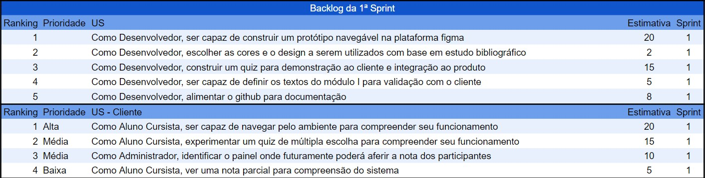

<h1 align="center"> Projeto API - 1º Semestre </h1>

## 🏛️ Curso de metodologia SCRUM 

## 🎯 Objetivo
O objetivo deste projeto é desenvolver um website interativo e educativo que capacite os usuários a dominarem a metodologia Scrum para o gerenciamento eficaz de projetos. Alunos do 1º semestre do curso de Análise e Desenvolvimento de Sistemas da FATEC liderarão o desenvolvimento desta plataforma

## 👁️ Visão do produto
A visão deste produto é criar um sistema web didático e formativo que sirva como uma ferramenta abrangente para ensinar a metodologia Scrum. Nosso objetivo é fornecer aos usuários uma compreensão detalhada dos princípios, processos e artefatos do Scrum, enquanto demonstramos como aplicá-los em diferentes contextos de projeto.

## 📅 Cronograma
<table>
  <tr>
    <td></td>
    <td>Início</td>
    <td>Fim</td>
  </tr>
  <tr>
    <td>Kick Off</td>
    <td>12/03</td>
    <td>12/03</td>
  </tr>
   <tr>
    <td>Sprint 1</td>
    <td>25/03</td>
    <td>14/04</td>
  </tr>
   <tr>
    <td>Sprint 2</td>
    <td>15/04</td>
    <td>05/05</td>
  </tr>
   <tr>
    <td>Sprint 3</td>
    <td>06/05</td>
    <td>26/05</td>
  </tr>
   <tr>
   <td>Sprint 4</td>
    <td>27/05</td>
    <td>16/06</td>
  </tr>
</table>

## 📋 BackLog do produto

## 🔰 Sprint 1
🔗 <a href="https://www.figma.com/file/AITmv8eBwOrtGHrH3mUCpp/ScrumTutor?type=design&node-id=0%3A1&mode=design&t=XtDlVeMKcAiUqZ5w-1">Link do Prótotipo</a>
## 📋 Backlog Sprint 1

## 🔰 Sprint 2
## 📋 Backlog Sprint 2

  
  

## Vídeo da navegação do incremento
Clique no ícone para acessar o vídeo no youtube: 

## 💻 Tecnologias
- 
-  
- 
- 
-  

## 🧰 Ferramentas
- 
- 

## 👥 Equipe Code Don´t Blow

 

|Nome|Função|GitHub|
| -------- |-------- |-------- 
|**Henrique Tadeu**|Desenvolvedor|[@GitHub](https://github.com/henrySilverIX)
|**Leonardo Cristiano**|Product Owner|[@GitHub](https://github.com/Leonardo-dSouza)
|**Luana Souza**|Scrum Master|[@GitHub](https://github.com/luanaapms)
|**Mariana Lins**|Desenvolvedor|[@GitHub](https://github.com/mariana-lins)
|**Rafael Gonçalves**|Desenvolvedor|[@GitHub](https://github.com/EstupendoG)
|**Vanessa Rodrigues**|Desenvolvedor|[@GitHub](https://github.com/Doryumi)
|**Ygor Pereira**|Desenvolvedor|[@GitHub](https://github.com/YgorPereira)

 

